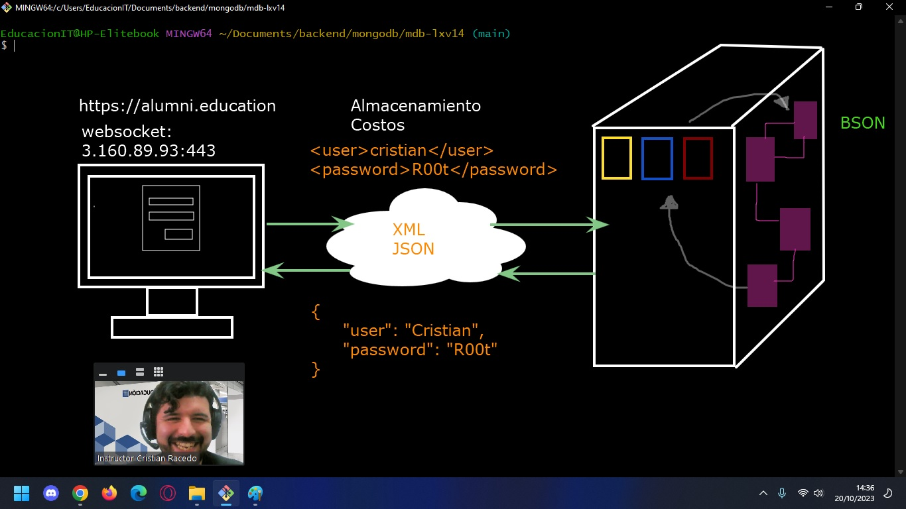

# Introduccion a MongoDB

Esto es una guia para los alumnos de la capacitacion de __Bases de datos NoSQL__ que cursan los dias _Lunes, Miercoles y Viernes de 14hs a 17hs_, donde se recapitularan los conceptos vistos en clase.

## Software
* [MongoDB Community](https://www.mongodb.com/try/download/community)
* [MongoShell](https://www.mongodb.com/try/download/shell)

## Introduccion Bases de Datos



Estructura que se utiliza para organizar y contener datos, optimizando el espacio disponible. Pueden de diferentes tipos y su contenido se distribuye en base a uso o funcionamiento.

### Relacional

La informacion se estructura en tablas y la funcion de las mismas consiste en definir grupos de datos. Para optimizar el almacenamiento se definen restricciones y tablas que vinculan un elemento con otro, evitando asi la duplicidad de datos. Estas se componen de los siguientes elementos:

* __Campos__(Columna): Conjunto de Datos de un mismo tipo
* __Registros__(Fila): Conjunto de Datos asociados entre si
* __Datos__(Celda): Minima porcion de Informacion

```
|TABLE:SPECIES|  |TABLE:COLORS |  |TABLE: ANIMALS                 |
|id | name    |  | id | name   |  |id | name   | specie  | color  |
|---|---------|  |----|--------|  |---|--------|---------|--------|
| 1 | perro   |  | 1  | rojo   |  | 1 |clifford|    1    | 3      |
| 2 | gato    |  | 2  | verde  |  | 2 |lassie  |    1    | 4      |
| 3 | caballo |  | 3  | azul   |  | 3 |simba   |    5    | 4      |
| 4 | delfin  |  | 4  | marron |  | 4 |kimba   |    5    | 6      |
| 5 | leon    |  | 5  | violeta| 
| 6 | tigre   |  | 6  | blanco |
```

En caso que necesitaramos mostrar el nombre, la especie y el color en un formato legible, deberiamos realizar una consulta de UNION para que nuestro servidor de base de datos combine los campos de las tablas que debe mostrar. En esta situacion solamente se ocupa espacio en memoria, para cargar temporalmente el valor de los nuevos campos.

```
SELECT a.name, s.name AS especie, c.name AS color 
FROM animals
JOIN species AS s ON s.id = a.specie
JOIN colros AS c ON c.id = a.color;

| name   | specie  | color  |
|--------|---------|--------|
|clifford|  perro  | rojo   |
|lassie  |  perro  | marron |
|simba   |  leon   | marron |
|kimba   |  leon   | blanco |

```

Existen diferentes __motores de Base de datos relaciones__ y migrar la informacion de uno a otro es relativamente facil, debido a que manejan un mismo estandar, a pesar que su sintaxis sea levemente diferente. Entre los motores mas populares, podemos encontrar los siguientes.

* MySQL
* MariaDB
* PostGree
* SQL Server
* Microsoft SQL
* SQLite

### Documentos (NoSQL)

Este tipo de Bases de datos, No relacional, almacena la informacion en archivos __BSON (Binary JavaScript Object Notation)__ donde se registran los datos en grupos de _clave/valor_. Estos pueden estar anidados y a diferencia de las bases de datos relaciones, se utilizan __colecciones__ de datos, en lugar tablas.

```
COLLECTION: ANIMALS
[
    {
        name: "cliford",
        specie: "perro",
        color: "rojo"
    },
    {
        name: "lassie",
        specie: "perro",
    },
    {
        name: "simba",
        specie: "leon",
        color: "marron"
    },
    {
        name: "kimba",
        specie: "leon",
    },
]
```

Podemos notar que, a diferencia del caso anterior, donde era necesario la creacion de relaciones para la optimizacion del espacio. En la bases de datos NoSQL, se prioriza el __tiempo de respuesta__ ya que el motor de base de datos no utiliza recursos para establecer restricciones, ni una estructura rigida.

Hoy en dia debido a que los costos de almacenamiento son relativamente economicos y que, con el paso del tiempo, es comun que se requiera una mayor cantidad de espacio para almacenar datos, este tipo de estructura es muy practica. 

__MongoDB optimiza el rendimiento__ de nuestra aplicacion, ya que al trabajar un _formato en comun (JSON)_ se reducen los tiempos de respuesta, es __facilmente escalable__ y es como para los desarrolladores, ya que no requiere la implementacion de consultas complejas para acceder a los datos.

Al utilizar __websockets__, ya que funciona como un __servicio de red__, debemos indicar un numero de _puerto de destino_ ademas de la __direccion IP__ de nuestro servidor. En una instalacion local estos serian los datos:

* __command__: mongodb (conexion)
* __host__: localhost (127.0.0.1)
* __port__: 27017 (registrado)
* __username__: "" (no required)
* __password__: "" (no required)

__comando:__ mongodb://localhost:27017


| SQL      | NoSQL    |
|----------|----------|
| Database | Database |
| Table    | Collection |
| Registros| Documentos |
| Campo    | Key      |
| Value    | Value    |

A diferencia de un sistema de bases de datos relacional, en MongoDB no es necesario que exista previamente una estructura para almacenar y organizar los datos, ya que esta sera creada al momento de realizar la operacion.

## Tabla de contenidos 

* [Metodos CRUD (CREATE READ UPDATE DELETE)](./crud.md)

## FILTROS

### Artimeticos

Cuando necesitamos filtrar textos o valores numericos podemos implementar alguno de los nombres reservadores para este tipo de operadores, que definen el criterio a tener en cuenta al momento de evaluar el valor de referencia.

| filtro | referencia | criterio | 
|--|--|--|
|$eq  | { _price_: 49999.99 } |  es igual a (por omision)  |
|$ne  | { _price_: { __$ne__: 49999.99 } } |  no es igual a |
|$gt  | { _stock_: { __$gt__: 200 } } |  mayor que (no incluye el valor) |
|$gte | { _stock_: { __$gte__: 200 } } |  mayor o igual a (inclusive) |
|$lt  | { _stock_: { __$lt__: 50 } } |  menor que (no incluye el valor) |
|$lte | { _stock_: { __$lte__: 50 } } |  menor o igual a (inclusive) |
|$in  | { _categories_: { __$in__: [ _'tecnologia'_, _'informatica'_ ] } } |  es algun valor de la lista |
|$nin | { _categories_: { __$nin__: [_'hogar'_, _'muebles'_ ] } } |  no es algun valor de la lista |

## Logicos

cuando necesitamos devolver valores en base a __multiples condiciones__, que pueden ser o no excluyentes podemos utilizar los siguiente operadores, que evaluaran toda la expresion e identificaran aquellos documentos que cumplan con los criterios.

| filtro | referencia | criterio | 
|--|--|--|
|$and | { _price_: 85699.99, _stock_: 10 } | todas las condiciones se deben cumplir (por omision)  |
|$or | { __$or__:[ { _price_: 85699.99}, {_stock_: 10 } ] } |  al menos una de las condiciones se debe cumplir |
|$not | { __$not__:[ { _price_: 85699.99}, {_stock_: 10 } ] } | ninguna de las condiciones se debe cumplir |
|$nor | { __$nor__:[ { _price_: 85699.99}, {_stock_: 10 } ] } | una de las condiciones debe cumplirse y la otra no |

## Claves

Cuando necesitamos realizar una actualizacion, puede que necesitemos __cambiar la estructura de nuestros documentos__, para ello debemos utilizar los operadores que afectan tanto a las claves, como a los valores del objeto.

| filtro | referencia | criterio | 
|--|--|--| 
|$inc | { __$inc__: {_price_: 500 } } | aumenta el valor del campo en la cantidad solicitada
|$set | { __$set__: { _postDate_: new Date() } } | define el valor a modificar de un documento |
|$unset | { __$unset__: {_post_: 1 } } | elimina la clave y su respectivo valor de un documento
|$rename| { __$rename__: { `"userData"` : `"user"` } } | cambia el nombre de una de las clave de documento